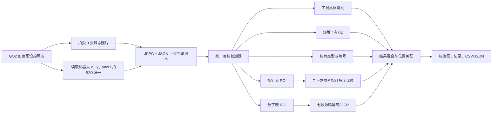

# GO2 上位机视觉识别 10 天实施方案

版本：V0.2  
日期：2026-07-28  
状态：历史版本（不再指导实现）
时间假设：共 10 个工作日；前 9 天开发与离线联调，第 10 天现场调试

> 当前范围与验收以 [`../最新赛项对齐矩阵.md`](../最新赛项对齐矩阵.md) 为准。本文件
> 保留用于追溯早期决策，其中旧项目名称、类别和交付范围不得继续用于新增实现。

## 1. 已确认的项目边界

### 1.1 GO2 负责的工作

- 到达预设拍照位置；
- 拍摄一张或一组静态照片；
- 同步取得拍照时的机器人位置和朝向；
- 将图片、位置、时间戳和拍照点编号发送到笔记本；
- 网络暂时中断时保留本地副本，恢复后补传。

GO2 不负责模型训练和视觉推理，不要求增加车载 GPU。

### 1.2 笔记本上位机负责的工作

- 接收图片和机器人位置；
- 识别传送带上的具体工具类别并画框；
- 判断是否存在煤堆并画框，不估计煤堆大小、体积或重量；
- 识别安全标牌类型和编号并画框；
- 指针式仪表只判断“正常/异常/无法判断”，不输出具体读数；
- 数字式仪表读取完整数字并记录；
- 把识别结果与拍照点、机器人位置、原图和证据裁剪图关联；
- 提供结果查看、人工修正和 CSV/JSON 导出。

### 1.3 有利条件

- 传送带静止；
- 工具不会重叠；
- 采用拍照后离线/准实时处理，不要求视频实时帧率；
- 巷道已有编号牌，可用作区段位置标识；
- 只判断煤堆是否存在，任务可由实例分割降级为普通目标检测。

## 2. 10 天内的推荐方案

### 2.1 总体数据流



### 2.2 为什么采用“拍 3 张”而不是单张

每个拍照点连续拍 3 张，间隔约 150～300 ms。传送带虽然静止，但三张图可以：

- 对数字表读数做多数投票；
- 避免单帧自动曝光过暗或过亮；
- 对指针角度取中位数；
- 某一张模糊时使用另外两张；
- 仍然只需处理少量图片，不增加明显计算压力。

上位机最终只生成一条融合结果，同时保存三张原图。

## 3. GO2 到笔记本的最小接口

### 3.1 传输方式

10 天 MVP 推荐使用 HTTP：

- GO2/采集端调用 `POST /api/v1/captures`；
- 笔记本 FastAPI 服务接收 multipart 图片和 JSON 元数据；
- 成功后返回 `capture_id`；
- GO2 端只有在收到成功响应后才删除待传队列；
- 识别结果通过 `GET /api/v1/results/{capture_id}` 查询。

HTTP 比引入完整消息中间件更容易在一天现场调试中抓包、重放和定位问题。已有 ROS 2 位姿可由采集程序读取后写入 JSON，不要求上位机视觉模块直接控制机器人。

### 3.2 每组照片的元数据

```json
{
  "capture_id": "go2_20260728_150001_station08",
  "capture_time": "2026-07-28T15:00:01.125+08:00",
  "station_id": "08",
  "robot_pose": {
    "frame": "map",
    "x_m": 12.41,
    "y_m": 3.08,
    "yaw_deg": 91.2
  },
  "camera_id": "go2_front",
  "images": [
    "frame_01.jpg",
    "frame_02.jpg",
    "frame_03.jpg"
  ]
}
```

如果 GO2 暂时取不到稳定的地图坐标，`station_id` 必须保留，机器人位置可以暂记为里程计坐标或空值。

### 3.3 上位机结果

```json
{
  "capture_id": "go2_20260728_150001_station08",
  "station_id": "08",
  "capture_pose": {"x_m": 12.41, "y_m": 3.08, "yaw_deg": 91.2},
  "objects": [
    {
      "type": "tool",
      "class": "wrench",
      "class_cn": "扳手",
      "bbox_xyxy": [510, 330, 750, 610],
      "confidence": 0.96,
      "location_text": "08号区段传送带"
    },
    {
      "type": "coal_pile",
      "present": true,
      "bbox_xyxy": [90, 520, 470, 890],
      "confidence": 0.94,
      "location_text": "08号区段地面"
    },
    {
      "type": "analog_meter",
      "status": "abnormal",
      "confidence": 0.92,
      "reason": "pointer_angle_delta_exceeds_tolerance"
    },
    {
      "type": "digital_meter",
      "raw_text": "600.0",
      "value": 600.0,
      "confidence": 0.98
    }
  ]
}
```

## 4. “位置”的 10 天验收口径

仅凭一张 RGB 图片和机器人自身位置，不能严谨地反推出目标的精确三维地图坐标。因此本期必须明确使用以下三层位置：

1. **图像位置——必须实现**：在原图上输出目标矩形框；
2. **现场区段——必须实现**：输出编号牌/拍照点，例如“08 号区段传送带”；
3. **拍照位置——必须实现**：保存拍照时的机器人 `x、y、yaw`；
4. **目标精确地图坐标——本期不承诺**：若固定拍照位姿和传送带平面尺寸已知，可在现场增加单应性标定作为增强项。

这样既能在图片上准确标记工具，又能让人员根据区段和机器人拍照位置回到现场查找，同时避免把机器人位置误报成目标精确坐标。

## 5. 上位机视觉算法

### 5.1 统一目标检测器

训练一个小型目标检测模型，候选为轻量 YOLO 系模型，类别包括：

```text
coal_pile
analog_meter
digital_meter
station_marker
safety_sign_<type>
tool_wrench
tool_hammer
tool_screwdriver
tool_pliers
...按最终工具清单扩展
```

选择普通检测而不是实例分割，原因是煤堆只需判定有无、工具静止且不重叠。使用普通检测可以减少标注和训练时间。

若工具种类超过约 10 类或外观非常相似，可把工具改成两级：

1. 检测器只找 `tool`；
2. 对工具框使用小型分类器判定具体类别。

10 天内优先选择在验证集上效果更稳定的方案，不为了架构统一强行使用单模型。

### 5.2 煤堆

- 输出 `present=true/false`、矩形框、置信度和区段；
- 不计算轮廓、面积、体积或重量；
- 把碎石堆、矸石堆、地面污渍、阴影和积水作为困难负样本；
- 如果业务上煤和矸石都算异常堆积，可直接统一标为 `material_pile`，但应在第 1 天冻结口径。

### 5.3 工具

- 必须输出具体类别、矩形框、置信度和区段；
- 每个工具只标一个框；
- 对未知或置信度不足的物体输出 `unknown_tool`，不得硬判成已知工具；
- 因为传送带静止且无重叠，不增加跟踪、运动分析或复杂实例分割。

### 5.4 指针式仪表正常/异常

本期不做通用表盘读数，采用更稳妥的“参考指针角度比较”：

1. 检测指针表；
2. 将表盘矫正到统一正视尺寸；
3. 定位圆心和指针方向；
4. 得到当前指针角度 `θ`；
5. 根据仪表/工位配置读取正常参考角度 `θ_ref` 和允许偏差 `Δθ_ok`；
6. 判定：

```text
|θ - θ_ref| ≤ Δθ_ok       -> normal
|θ - θ_ref| > Δθ_ok       -> abnormal
指针/表盘看不清或角度冲突  -> uncertain
```

上位机只显示“正常/异常/无法判断”，角度仅用于内部诊断。每种表或每个工位必须提供正常参考照片和允许偏差；不同量程的仪表不能共用同一个阈值。

`uncertain` 是必要的安全输出。模糊、强反光、表盘遮挡时不允许自动判成正常。

### 5.5 数字式仪表读数

针对当前红色七段数码表，采用“双路径”：

1. **主路径**：显示区透视矫正 → HSV/亮度分割 → 七段状态解码 → 小数点检测；
2. **后备路径**：数字 OCR；
3. 三张照片分别读取，至少两张完全一致才确认；
4. 同时保存 `raw_text` 和解析后的数值 `value`；
5. 无法形成多数结果时输出 `unreadable`，保留裁剪图供人工修正。

必须覆盖：

- 0～9；
- 小数点；
- 可能存在的负号；
- 前导零；
- 黑屏、缺段、过曝和反光；
- 显示值超出正常范围时仍要记录原始数字。

### 5.6 安全标牌和编号

- 检测标牌框；
- 透视矫正；
- 标牌类型分类；
- 固定的 1～N 号牌优先使用分类模型，不依赖整图 OCR；
- 未见过的编号使用 OCR 后备；
- 多张照片投票；
- 输出标牌类型、编号、矩形框和区段。

## 6. 笔记本上位机实现

### 6.1 推荐技术栈

- Python 3.10/3.11；
- FastAPI：图片和位姿接收接口；
- OpenCV：表盘/显示区矫正和七段数码处理；
- PyTorch 训练；
- NVIDIA GPU 笔记本：直接 PyTorch 或 ONNX Runtime GPU；
- 无 NVIDIA GPU：导出 ONNX Runtime CPU；本项目按照片处理，可接受数秒延迟；
- SQLite：单机记录；
- Streamlit 或简单 Web 页面：查看原图、标注图和人工修正；
- CSV/JSON：结果导出。

不在 10 天内建设复杂微服务、云平台或完整机器人调度系统。

### 6.2 最小目录和模块

```text
go2_inspection/
  app/
    api.py
    pipeline.py
    detector.py
    analog_status.py
    digital_reader.py
    sign_reader.py
    storage.py
    ui.py
  configs/
    classes.yaml
    stations.yaml
    analog_reference.yaml
  models/
  data/
    incoming/
    processed/
    evidence/
    database/
  tests/
  scripts/
    start_server.ps1
    replay_capture.py
    export_report.py
```

## 7. 第 1 天的数据硬门禁

目前工作区只有 4 张图片，其中只有 2 张现场图。为了让第 10 天用于“调试”而不是第一次训练，第 1～2 天必须拿到真实视角数据。

### 7.1 必须提供

- 最终工具类别清单、中文名称和每类参考照片；
- GO2 或接近 GO2 高度拍摄的传送带照片；
- 煤堆正样本以及空地面、碎石、阴影、积水负样本；
- 每个指针表的正常参考照片；
- 可安全获得的偏低/偏高指针照片，或允许使用合成旋转指针做辅助；
- 数字表显示不同数字的照片，至少覆盖 0～9 和小数点；
- 全部安全标牌和编号；
- 一组真实的图片 + 位姿 JSON 样例。

### 7.2 建议的最小数量

| 类别 | 第一次可训练的最低建议量 |
|---|---:|
| 每种工具 | 30～50 张真实场景图，至少 8 个方向/摆放变化 |
| 煤堆 | 80～120 张正样本，150 张以上困难负样本 |
| 每种安全标牌 | 20～30 张，包含正视和斜视 |
| 每个编号 | 15～20 张，包含近中远距离 |
| 每个指针表 | 正常 20～30 张，偏高/偏低或合成异常各 20 张以上 |
| 数字表 | 100～200 个显示区裁剪，覆盖所有可能字符 |

最低数量不是最终保证。若工具类别多、外观相近或视角差异大，应优先增加真实图，而不是只增加几何增强。

### 7.3 数据切分

- 按拍摄批次切分训练/验证/测试，建议 70%/15%/15%；
- 同一次三连拍不能拆到不同集合；
- 产品白底图只作辅助，测试集必须全部来自真实场景；
- 最后一天现场采集的数据另建现场测试集，不混入当天验收统计前的训练集。

## 8. 9 天开发 + 1 天现场调试

### 第 1 天：冻结需求和通信样例

- 确认 GO2 型号、相机取图方法、位姿来源；
- 冻结工具类别、煤/矸石口径、标牌类别；
- 明确每个指针表的正常参考和允许偏差；
- 定义 HTTP/文件包接口和输出 JSON；
- 取得第一批真实照片和位姿样例；
- 建立数据集目录和标注规范。

**当天门禁**：必须能重放至少一组“图片 + 位姿”数据；工具类别表和仪表参考表不能继续悬空。

### 第 2 天：采集、标注和上位机骨架

- 完成 FastAPI 接收、落盘和 capture ID；
- 完成 SQLite 基础表；
- 标注第一批工具、煤堆、仪表和标牌；
- 生成训练/验证/测试清单；
- 制作结果画框和 JSON 输出骨架。

**当天交付**：传入一组图片后可以生成一条空模型结果，并在页面查看原图和位姿。

### 第 3 天：工具与煤堆基线

- 微调统一检测模型；
- 工具输出具体类别；
- 煤堆输出有/无和框；
- 加入 `unknown_tool` 和置信度阈值；
- 统计每类 Precision、Recall 和混淆矩阵。

**当天门禁**：真实验证集可以批量推理，错误案例自动保存。

### 第 4 天：安全标牌、编号和位置关联

- 标牌检测与透视矫正；
- 固定编号分类/OCR；
- 将所有识别结果关联 `station_id` 和机器人拍照位姿；
- 输出“08 号区段传送带”等位置文字；
- 完成标注图。

### 第 5 天：数字表读数

- 检测数字表和显示区；
- 完成七段状态解码、小数点和负号处理；
- 加入 OCR 后备；
- 完成三张图多数投票；
- 保存原始字符串、数值和证据裁剪图。

**当天门禁**：冻结的数字表测试裁剪集可输出逐样本正确/错误清单。

### 第 6 天：指针表正常/异常

- 表盘矫正和圆心/指针方向检测；
- 配置每个工位的正常参考角度和容差；
- 输出 `normal/abnormal/uncertain`；
- 强反光、模糊和遮挡样本必须进入 `uncertain`；
- 加入调试图，显示参考角度和当前角度。

### 第 7 天：全链路联调

- GO2/重放程序上传三连拍和位姿；
- 上位机完成全部识别；
- 结果入库、页面查看、人工修正；
- CSV/JSON 导出；
- 网络中断后的缓存补传；
- 统一日志和错误码。

### 第 8 天：困难样本和回归

- 处理工具相似类别、煤堆/碎石、湿地/阴影误检；
- 处理数字表过曝、缺段和小数点；
- 处理表盘斜视和反光；
- 调整各任务阈值，不使用一个全局阈值；
- 执行完整冻结测试集回归。

### 第 9 天：冻结与现场预演

- 冻结模型、配置和测试集；
- 在目标笔记本从干净环境启动；
- 使用历史数据模拟完整路线；
- 准备现场参数表、工具清单和正常仪表参考；
- 准备 GPU/CPU 两套启动配置；
- 准备离线重放、人工修正和日志导出；
- 列出现场只允许调整的参数：相机曝光、ROI、阈值、拍照位姿和正常参考角度。

**当天门禁**：不能依赖开发机隐含环境；断网状态也能处理已收到的图片。

### 第 10 天：现场调试

建议时间分配：

| 时间 | 工作 |
|---|---|
| 0～1 小时 | 网络、时间戳、相机、位姿和上传检查 |
| 1～2 小时 | 每个拍照点构图、曝光、ROI 和区段编号校准 |
| 2～3 小时 | 采集正常仪表基准、数字表和所有工具快速样本 |
| 3～5 小时 | 单点任务逐项测试并调整阈值/参考角度 |
| 5～7 小时 | 连续完成至少 3 次全路线巡检 |
| 7～8 小时 | 回归、结果导出、备份配置和现场签字确认 |

现场不计划进行大规模重新训练。只有在已有自动化训练脚本且新增样本标注量很小时，才进行一次短时微调；否则当天只调整拍照位姿、曝光、ROI、阈值和参考配置。

## 9. POC 验收指标

指标只在约定拍照点、照明和目标范围内成立。

| 能力 | 10 天 POC 建议门槛 |
|---|---|
| 图片/位置传输 | 完整巡检上传成功率 ≥ 99%；断网图片不丢失 |
| 工具识别 | 已知工具具体类别准确率 ≥ 90%，目标检出率 ≥ 95%，框位置明显覆盖目标 |
| 未知工具 | 低置信度时输出 `unknown_tool`，不得强行归入已知类 |
| 煤堆 | 有煤堆检出率 ≥ 95%；空场景误报率 ≤ 5% |
| 安全标牌/编号 | 标牌类别和编号整串准确率 ≥ 95% |
| 指针表状态 | 正常/异常准确率 ≥ 90%，异常召回率 ≥ 95%；不可读样本输出 `uncertain` |
| 数字表 | 三连拍融合后的完整字符串准确率 ≥ 95%，同时记录原始字符串和数值 |
| 位置 | 100% 结果包含图像框、`station_id` 和拍照时机器人位姿或明确的位姿缺失标记 |
| 处理时间 | GPU 笔记本每组三张图建议 ≤ 5 s；CPU 降级建议 ≤ 15 s |
| 完整巡检 | 现场连续 3 次路线可完成接收、识别、保存和导出，无崩溃 |

最终验收必须保存：

- 每一项错误对应的原图；
- 混淆矩阵和逐类别指标；
- 数字表逐字符串正确率；
- 指针表正常、异常、无法判断三类数量；
- 网络/位姿缺失日志；
- 三次现场完整巡检报告。

## 10. 失败降级策略

| 问题 | 降级方式 |
|---|---|
| GO2 地图位姿不稳定 | 保留拍照点编号和里程计位姿，不伪造地图坐标 |
| 网络中断 | GO2/采集端本地排队，恢复后按 capture ID 补传 |
| 上位机无可用 GPU | 使用 ONNX CPU，接受更长处理时间 |
| 工具置信度不足 | 输出 `unknown_tool` 并保存裁剪图 |
| 数字表三张读数不一致 | 输出 `unreadable`，保留三张裁剪图，允许人工录入 |
| 指针表反光或看不清 | 输出 `uncertain`，不判为正常 |
| 标牌编号看不清 | 输出标牌类型和 `id_text=null` |
| 最后一天出现新类别 | 记录为未知类别，不临时修改已冻结标签体系 |

## 11. 当天必须确认的配置项

为保证计划不在第 1 天停滞，需要尽快填完以下表：

```yaml
tools:
  - id: wrench
    name_cn: 扳手
  - id: hammer
    name_cn: 锤子

stations:
  - id: "08"
    location_name: 08号区段传送带
    expected_sign: blue_round

analog_meters:
  - id: meter_station_08
    station_id: "08"
    normal_reference_image: references/meter_station_08_normal.jpg
    normal_angle_deg: 42.0
    tolerance_deg: 5.0

digital_meters:
  - id: digital_station_08
    station_id: "08"
    decimal_places: 1
    unit: null
```

其中工具清单、指针表正常参考和数字表显示格式是算法无法自行猜测的业务配置。

## 12. 交付物

第 9 天应具备：

- 上位机源码和锁定的依赖环境；
- 模型权重和类别配置；
- GO2/数据重放上传程序；
- HTTP 接口说明；
- 工具、标牌、仪表配置文件；
- 原始数据、标注数据和冻结测试集；
- 启动/停止脚本；
- 原图、标注图、证据图和 SQLite 数据库；
- CSV/JSON 导出工具；
- 离线测试报告；
- 现场调试检查表和回退方案。

第 10 天补充：

- 现场相机/拍照点配置；
- 每个指针表的现场正常参考；
- 三次完整巡检记录；
- 现场验收结果和遗留问题清单。

## 13. 方案取舍总结

在 10 天约束下，本方案主动不做：

- 车载模型推理；
- 煤堆面积、体积或重量；
- 目标精确三维地图坐标；
- 传送带运动目标跟踪；
- 工具遮挡和重叠处理；
- 通用指针表精确读数；
- 复杂云平台和自主机器人调度。

资源集中在真正需要交付的链路：

```text
GO2 拍照/位置
  → 笔记本可靠接收
  → 工具具体类别和图像位置
  → 煤堆有/无
  → 标牌类型和编号
  → 指针表正常/异常/无法判断
  → 数字表具体读数
  → 区段位置、记录和导出
```

这一路径在当前静态、无遮挡、定点拍照的条件下具有可执行性；成功的首要前提是第 1～2 天拿到真实 GO2 视角数据，而不是把真实数据采集推迟到最后一个现场日。
