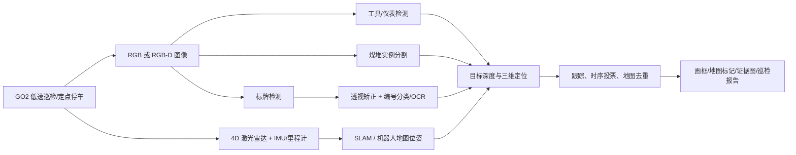

# 煤矿实验室 GO2 视觉识别技术方案（初稿）

版本：V0.1  
日期：2026-07-28  
适用范围：煤矿实验室模拟巷道/传送带环境，不等同于井下防爆场景

> 状态说明：本文件是宽范围方案。项目后续已收敛为“GO2 拍照并上传图片/位姿，笔记本上位机识别，9 天开发 + 1 天现场调试”。当前执行版本请以 [GO2上位机视觉识别_10天实施方案_V0.2.md](./GO2上位机视觉识别_10天实施方案_V0.2.md) 为准。

## 1. 结论摘要

建议把项目拆成四条相互独立、最后融合的能力链：

1. **传送带工具/仪表识别**：检测或实例分割，输出类别、置信度和图像框/轮廓。
2. **煤堆/散落物识别**：实例分割优先，输出轮廓、中心、占地范围；如果以后需要体积，再增加点云体积估计。
3. **安全标牌与编号识别**：先检测标牌，再做透视矫正和编号分类/OCR，不建议直接对整幅图做 OCR。
4. **空间定位与巡检事件融合**：用 RGB-D 深度或相机—激光雷达融合得到目标三维坐标，再通过 GO2 的定位结果变换到地图坐标；用多帧跟踪和投票去重。

推荐的首版系统是：

- GO2 EDU；
- 轻量抬高的 RGB-D/工业相机，镜头高度初步建议 0.8～1.0 m，俯视传送带 20°～35°，最终以现场测量为准；
- GO2 自带 4D 激光雷达负责建图和机器人位姿，RGB-D 负责近距离目标深度；
- Orin 40 TOPS 级以上模块做车载 TensorRT 推理；没有车载算力时先用外部 GPU 工控机；
- ROS 2 Humble + Unitree SDK2/CycloneDDS；
- 巡检初期采用“低速行走 + 到编号点停车拍摄”，暂不追求边走边识别。

**现有 4 张图片只能用于需求理解，不能支持训练或客观验收。** 项目第一阶段的重点不是换模型，而是完成真实机器人视角的数据采集、类别定义和相机安装验证。

## 2. 当前素材盘点与场景判断

`fig` 目录目前有 4 张图片：

| 文件 | 分辨率 | 观察到的内容 | 对项目的意义 |
|---|---:|---|---|
| 微信图片_20260728145300_104_5.jpg | 1280×1707 | 传送带侧面、蓝色圆形编号牌“10” | 编号牌近景；存在反光、倾斜和金属结构干扰 |
| 微信图片_20260728145301_105_5.jpg | 1707×1280 | 长巷道、传送带、7～9 号牌、地面料堆、积水反光、管材和支架 | 真实巡检场景；远处编号是小目标，煤/石料与脏污地面容易混淆 |
| 微信图片_20260728145303_106_5.png | 1128×1140 | 0～20 V 指针式电压表产品图 | 可定义“指针仪表”类别；若要读数，需独立算法分支 |
| 微信图片_20260728145303_107_5.png | 1148×648 | 显示 600.0 的数码表产品图 | 可定义“数码仪表”类别；若要读数，需七段数码识别分支 |

当前数据的主要缺口：

- 只有 2 张真实场景图；
- 没有“工具/仪表放在实际传送带上”的机器人视角图片；
- 产品白底图和现场图存在严重域差异，不能直接代表现场识别效果；
- 没有实际安全警示牌样本，当前只有工位/区段编号牌；
- 现场图中的料堆偏灰，需确认它是煤、矸石、碎石，还是统一按“散落料堆”管理；
- 没有 GO2 相机原始视频、相机标定参数、机器人位姿、激光点云或传送带运行速度。

## 3. 需求边界与统一输出

### 3.1 首版必须实现

- 工具/仪表类别识别；
- 图像中的框或分割轮廓；
- 煤堆/散落物分割与位置；
- 安全标牌类别、编号内容和位置；
- 相同目标跨帧去重；
- 保存证据图、时间、置信度、机器人位姿和目标地图坐标；
- 在操作端展示和导出巡检结果。

### 3.2 可选增强

- 指针表读数；
- 数码表读数；
- 煤堆体积或重量估计；
- 传送带上目标计数、流向和速度；
- 异常规则，例如“某工具出现在禁放区”“某区段有煤堆占道”。

### 3.3 建议输出结构

```json
{
  "timestamp": "2026-07-28T15:00:00.000+08:00",
  "robot_pose_map": {"x": 0.0, "y": 0.0, "z": 0.0, "yaw": 0.0},
  "category": "station_marker",
  "subtype": "blue_round",
  "id_text": "10",
  "bbox_xyxy": [410, 220, 620, 500],
  "mask": null,
  "confidence": 0.97,
  "readable": true,
  "position_camera_m": [1.2, -0.1, 0.4],
  "position_map_m": [8.6, 2.1, 0.7],
  "track_id": 37,
  "evidence_image": "..."
}
```

这里要明确区分两种“位置”：

- **图像位置**：边界框或轮廓，用于画框；
- **物理位置**：相机坐标、机器人坐标或地图坐标，用于导航、告警和复查。

## 4. 推荐总体架构



推荐的软件节点：

- `go2_bridge`：Unitree SDK2/ROS 2 通信和机器人状态；
- `camera_node`：RGB/RGB-D 取流、时间戳和相机参数；
- `slam_localization`：机器人地图位姿；
- `detector`：工具、仪表和标牌检测；
- `coal_segmenter`：煤堆/散落物实例分割；
- `sign_reader`：标牌矫正、类型识别和编号读取；
- `meter_reader`：可选的指针表/数码表读数；
- `target_localizer`：二维目标到三维/地图坐标；
- `tracker_fusion`：跨帧跟踪、投票、空间聚类去重；
- `inspection_backend`：事件存储、查询、可视化和报告。

## 5. 各视觉任务的算法方案

### 5.1 传送带工具和仪表

首版使用轻量实时检测器；工具重叠严重或需要准确落点时改为实例分割。候选技术可以是 YOLO 系 n/s 级检测/分割模型或 RT-DETR 轻量骨干，最后按真实数据和 Orin 上的延迟决定，不预先绑定某个模型版本。

建议类别层级：

```text
tool
  ├─ wrench / hammer / screwdriver / pliers / ...
instrument
  ├─ analog_voltmeter
  └─ digital_meter
unknown_object
```

工具清单必须由现场先确认。外观近似但业务处置相同的类别宜合并，避免数据量被过度切碎。对于未列入清单的物体，首版可用 `unknown_object` 或异常检测作为补充，但不能把开放词汇模型当作最终在线判定器。

### 5.2 煤堆/散落物

采用实例分割而不是矩形框，原因是：

- 煤堆形状不规则；
- 需要判断是否侵入通道或传送带下方；
- 后续体积估计需要轮廓或点云区域；
- 地面污渍、阴影和料堆颜色接近，框的业务意义较弱。

初版标签建议至少区分：

- `coal_pile`；
- `rock_or_gangue_pile`；
- `spill_unknown`；
- `floor_stain_or_shadow` 作为困难负样本，不一定作为输出类别。

若业务不要求区分煤和矸石，可合并为 `material_pile`，但需在标注前确定，训练中途不要反复改口径。

三维位置取分割区域内的有效深度中位数或下缘接地点；煤堆中心、离机器人最近点、侵入通道的边界可同时保存。若以后做体积，则把分割 mask 投影到点云，拟合地面后积分高度差。

### 5.3 安全标牌与编号

使用“两阶段”方法：

1. 检测标牌，输出旋转框或四角点；
2. 透视矫正为正视图；
3. 标牌类型分类；
4. 编号分类或 OCR；
5. 多帧置信度融合。

对于当前 1～N 的固定编号牌，**直接做 N 类编号分类通常比通用 OCR 更稳定**；通用 OCR 可作为未知编号的后备。若以后加入中文安全标牌，可增加中文 OCR，但业务告警仍应优先基于视觉类型分类，不应只依赖文字识别。

远处编号的可识别性由字符像素高度决定。巡检路线应让机器人靠近并面向编号牌，必要时停车拍一组不同曝光图。模型无法恢复图像中本来不存在的字符细节。

### 5.4 指针表与数码表读数（可选）

**指针表**：

- 检测表盘并做椭圆/透视校正；
- 关键点模型定位圆心、量程起点、量程终点；
- 分割或线检测得到指针方向；
- 角度映射到读数；
- 结合表盘类型得到单位和量程。

**数码表**：

- 检测显示区域并矫正；
- 用专用七段数码分类器或 OCR 读取字符与小数点；
- 多帧投票并检测闪烁/缺段；
- 对过曝的红色 LED 使用受控曝光，必要时单独拍摄短曝光帧。

仪表“类别识别”和“准确读数”应分别验收。

## 6. 目标空间定位

### 6.1 推荐方法

1. 激光雷达/IMU SLAM 输出机器人在地图中的位姿 `T_map_base`；
2. 标定相机相对机器人机身的外参 `T_base_cam`；
3. 通过 RGB-D 深度或激光点云找到目标像素对应的深度 `D`；
4. 使用相机内参 `K` 把像素 `(u,v)` 反投影到相机坐标：

```text
P_cam = D · K⁻¹ · [u, v, 1]ᵀ
P_map = T_map_base · T_base_cam · P_cam
```

5. 对连续多帧的 `P_map` 聚类，得到稳定目标点并去除重复报告。

### 6.2 不同目标的落点定义

- 传送带工具：mask/框下缘中心或目标表面深度中位数；
- 标牌：标牌平面中心；
- 煤堆：最近边界点、占地区域中心和最高点可分别输出；
- 无有效深度时：使用已标定的传送带平面做单应性映射，或者只输出所属区段编号，不伪造三维距离。

### 6.3 标定

必须完成：

- 相机内参和畸变；
- RGB 与深度对齐；
- 相机到机身外参；
- 雷达到机身外参；
- 时间同步；
- 传送带平面或通道地图；
- 以已知测量点验证地图坐标误差。

编号牌可作为业务区段锚点，但不建议只依赖自然图像编号做 SLAM。若现场允许，可在隐蔽位置增加 AprilTag/ArUco 作为标定和回归测试基准，不改变业务标牌外观。

## 7. GO2 集成和硬件建议

### 7.1 先确认 GO2 版本

GO2 目前有 AIR、PRO、X、EDU 等配置。官方产品页显示 EDU 提供完整二次开发能力，并可选 Orin 40～100 TOPS 级高算力模块和深度相机；AIR/PRO 的二次开发能力并不等同于 EDU。开工前必须记录：

- 具体型号和购机配置；
- 固件版本；
- 是否有高算力模块及其型号、内存和系统镜像；
- 是否能获取前置相机、4D 雷达、机器人位姿；
- 是否有可用以太网、USB 和附件供电；
- 是否已购深度相机；
- 当前 SDK2/ROS 2 通信是否正常。

### 7.2 推荐部署路径

| 条件 | 部署方式 | 说明 |
|---|---|---|
| GO2 EDU + Orin | 车载推理，推荐 | 图像不离车，延迟和网络依赖低；模型用 TensorRT FP16，稳定后再评估 INT8 |
| GO2 EDU、无 Orin | 外部 GPU 工控机/工作站 | GO2 发送图像和位姿；适合首版开发，需控制网络延迟和丢包 |
| GO2 非 EDU | 先核对厂商开放接口 | 可把感知全部放在独立相机和独立计算单元，但机器人控制、相机和位姿接口不能按 EDU 能力假设 |

官方 `unitree_ros2` 采用 CycloneDDS，并建议 Ubuntu 22.04 + ROS 2 Humble；官方 `unitree_sdk2_python` 提供 OpenCV 读取前置相机的示例。首版建议沿用这一通信栈。

### 7.3 相机和安装

GO2 官方站立高度约 40 cm，而现场传送带上表面明显高于机头视线。仅用内置前置相机可能只能看到传送带侧面或底部，无法稳定识别带面工具。因此建议：

- 先用纸板模型/运动相机做 0.6、0.8、1.0 m 三档高度视野测试；
- 使用轻量、刚性、带减振的相机支架；
- 镜头略向下俯视带面，同时覆盖编号牌；
- 总载荷和重心留出充足余量，巡检速度降低；
- 相机外参每次拆装后复核；
- 灯具采用漫射恒流光源，避免照在反光牌和湿地面上形成白斑。

POC 可先用官方可选的 D435i 类深度相机。若传送带运行较快、工具有明显运动模糊，应换用短曝光/全局快门工业相机；深度相机可继续负责停车后的三维定位。

### 7.4 巡检策略

首版：

- 行走速度 0.2～0.4 m/s；
- 在每个编号区段设置观测位姿；
- 到点停车 0.5～1.5 s，采集 5～15 帧；
- 对编号、工具和仪表读数做多帧投票；
- 定位与图像时间戳对齐；
- 发现异常只上报，不直接驱动机器人做危险动作。

稳定后再逐步过渡到连续识别。

## 8. 数据采集与标注规划

### 8.1 第一轮采集

建议采集 2～4 小时 GO2 原始数据，覆盖：

- 空带、不同工具类别、多个工具重叠、遮挡和不同朝向；
- 传送带静止和不同速度；
- 小、中、大煤堆，以及煤、矸石、污渍、阴影、积水等困难负样本；
- 每类安全标牌和所有编号；
- 近、中、远距离以及正视、斜视；
- 开灯/关灯、明暗区域、头灯眩光；
- 镜头轻微积尘、机器人走动振动；
- 人员、管材、螺栓、支架等非目标物；
- 所有数据同步保存 RGB、深度、点云、机器人位姿和时间戳。

从视频按 1～2 FPS 初采样，再用图像相似度去重，形成约 3000～6000 张候选图；第一轮精标 1500～2500 张，优先覆盖长尾和困难情况。相邻视频帧不能随机拆到训练集和测试集。

### 8.2 标注格式

| 对象 | 标注 | 属性 |
|---|---|---|
| 工具/仪表 | bbox；重叠严重时 polygon/mask | 类别、遮挡、截断、模糊 |
| 煤堆/料堆 | polygon/mask | 煤/矸石/未知、是否侵入通道 |
| 编号牌 | 四角点或旋转框 | 标牌类型、`id_text`、可读/不可读 |
| 安全标牌 | 四角点或旋转框 | 安全类别、文字、可读/不可读 |
| 仪表显示区 | 四角点 | 仪表类型、读数、单位、可读性 |

训练/验证/测试按“采集日期 + 路段 + 摆放批次”分组切分，建议 70%/15%/15%，测试集冻结。白底产品图仅用于类别定义、合成预训练或少量增强，实际场景数据应占主导。

### 8.3 迭代方式

1. 第一版模型推完整个未标注视频；
2. 收集高置信误检、低置信目标和漏检；
3. 人工修正并回流；
4. 每轮只增加最有信息量的样本；
5. 持续维护固定回归测试集，避免“新场景变好、旧场景退化”。

## 9. 初步里程碑（按 8 周估算）

资源假设：1 名视觉算法工程师、1 名机器人/ROS 工程师、现场人员兼职采集标注；硬件和接口可按时到位。

| 周期 | 任务 | 交付/门禁 |
|---|---|---|
| 第 1 周 | 明确类别、GO2 配置、相机高度和巡检路线；打通取流与 rosbag | 需求字典、接口清单、首条带位姿数据包 |
| 第 2 周 | 系统采集、标注规范、首批 500～800 张精标 | 标注样例审查通过；测试集切分规则冻结 |
| 第 3 周 | 工具/仪表检测、煤堆分割基线 | 离线基线报告和主要错误清单 |
| 第 4 周 | 标牌矫正、编号分类/OCR、多帧投票 | 近中远距离编号准确率报告 |
| 第 5 周 | RGB-D/雷达三维定位、内外参标定 | 已知点定位误差报告 |
| 第 6 周 | ROS 2 节点整合、Orin 或外部 GPU 实时部署 | 单次巡检全链路演示 |
| 第 7 周 | 现场难例回采、模型优化、事件去重和界面 | 连续多轮巡检，无重复刷屏 |
| 第 8 周 | 冻结模型、压力测试、验收和文档 | 验收报告、部署包、标定和操作说明 |

如果只做图像框、不做三维地图定位和仪表读数，可压缩到约 4～5 周；若同时要求煤堆体积和两类仪表精确读数，应增加 2～4 周。

## 10. POC 验收建议

以下指标是初始门槛，最终应在采集基线后锁定，并明确距离、目标尺寸和照明条件。

| 项目 | 建议 POC 指标 |
|---|---|
| 工具/仪表检测 | 在冻结测试集上，每类 Precision ≥ 95%，Recall ≥ 90%；长尾类别单独报告 |
| 煤堆分割 | 实例 Recall ≥ 95%，mask IoU 中位数 ≥ 0.80；侵入通道判断单独验收 |
| 编号牌 | 在约定巡检距离且字符高度 ≥ 20 px 时，编号整串准确率 ≥ 98% |
| 安全标牌 | 类型准确率 ≥ 95%；未知/不可读不得强行输出编号 |
| 物理定位 | 0.5～3 m 范围内，水平位置误差 P95 ≤ 15 cm |
| 时延 | 车载端端到端 ≥ 8 FPS，或停车后 1 s 内完成一次稳定判定 |
| 时序稳定性 | 同一目标同一巡检只生成一个事件；误报少于 1 次/完整巡检 |
| 数码表读数（可选） | 整串准确率 ≥ 98% |
| 指针表读数（可选） | 绝对误差 ≤ 1 个最小刻度，或 ≤ 2% 满量程 |

测试报告除总指标外，必须分开列出：

- 近/中/远距离；
- 正视/斜视；
- 静止/行走；
- 正常/弱光/眩光；
- 清洁/积尘镜头；
- 各单独类别；
- 有遮挡/无遮挡。

## 11. 主要风险和应对

| 风险 | 影响 | 应对 |
|---|---|---|
| 现有数据只有 4 张 | 无法训练或验收 | 先打通 GO2 视角数据采集，采用主动学习 |
| GO2 版本不明 | SDK、相机、算力和控制能力可能不满足 | 先确认 AIR/PRO/X/EDU、固件和附件 |
| 内置相机高度低 | 看不到传送带上表面 | 抬高相机、优化观测点，或局部增加固定顶视相机 |
| 编号过小 | OCR 无法恢复细节 | 靠近、停车、提高焦距/分辨率、标牌两阶段识别 |
| 白底图与现场域差异大 | 工具/仪表现场漏检 | 真实带面数据为主，白底图只做辅助 |
| 煤、矸石、阴影、湿地外观接近 | 煤堆误检 | 明确标签、增加困难负样本、使用 mask + 深度 |
| 黑色煤面对深度不友好 | 深度孔洞和跳变 | mask 内稳健统计、多帧融合、雷达补充、失败时降级为区段定位 |
| 传送带运动导致模糊 | 小工具和数字漏检 | 短曝光、增强照明、全局快门、同步触发 |
| 反光牌和积水眩光 | 编号和分割不稳定 | 漫射灯、偏振、HDR/多曝光、改变拍摄角度 |
| 支架振动/拆装 | 外参漂移、位置错误 | 刚性减振结构、锁紧件、每日快速标定检查 |
| 网络不稳定 | 外部推理丢帧 | 车载推理优先，外部推理使用独立 Wi-Fi 6/以太网并缓存 |
| 从实验室直接扩展到井下 | 安全和合规风险 | 重新做防爆、本安、煤安、电气和环境评估 |

## 12. 安全与合规边界

GO2 官方将产品描述为民用机器人。即使算法在实验室验证成功，也不能据此认定机器人、相机、计算模组、电池、灯具和线缆满足井下瓦斯/煤尘环境的防爆、本安或煤安要求。

本方案当前只适用于经现场安全负责人确认的实验室模拟环境。若将来进入真实煤矿井下，应把防爆认证、煤安认证、电气隔离、表面温度、静电、粉尘防护、应急停机和通信合规作为一个独立项目重新评审。

## 13. 开工前需要锁定的 10 项信息

1. GO2 的确切版本、固件和计算模块；
2. 是否已经能通过 SDK2/ROS 2 获取相机、雷达和机器人位姿；
3. 传送带高度、宽度、速度和是否允许停车观察；
4. 全部工具/仪表类别清单以及外观变体；
5. “煤堆”是否包含矸石/碎石/散落料；
6. 安全标牌类别、编号范围和真实样本；
7. 是否只需识别仪表类别，还是必须读取数值；
8. “位置”只要画框，还是需要地图坐标；所需精度是多少；
9. 实验室是否存在煤尘/可燃气体风险以及允许安装的照明和支架；
10. 最终运行模式是人工遥控巡检、固定路线自主巡检，还是两者都要。

## 14. 建议的下一步

第一步不是开始大规模标注，而是完成一次 **半天现场工程勘察 + GO2 数据试采**：

1. 测量传送带和标牌高度；
2. 在 0.6、0.8、1.0 m 三个镜头高度录制同一路段；
3. 每种工具至少摆放 10 种姿态，煤堆做 3 种尺寸；
4. 同步记录 RGB、深度、点云和机器人位姿；
5. 当天抽取 100 张图做试标；
6. 训练一个极小基线，验证“视角和数据是否可学”；
7. 根据误检/漏检结果再冻结硬件安装和完整标注规范。

## 15. 参考资料

- [Unitree Go2 官方产品页](https://www.unitree.com/go2/)
- [Unitree Go2 APP 与 3D 激光建图说明](https://www.unitree.com/cn/app/go2/index.html)
- [Unitree ROS 2 官方仓库](https://github.com/unitreerobotics/unitree_ros2)
- [Unitree SDK2 Python 官方仓库（含前置相机 OpenCV 示例）](https://github.com/unitreerobotics/unitree_sdk2_python)
- [Unitree Go2 官方配件页（列出 D435i、高算力模块等）](https://www.unitree.com/cn/go2/charger/)
